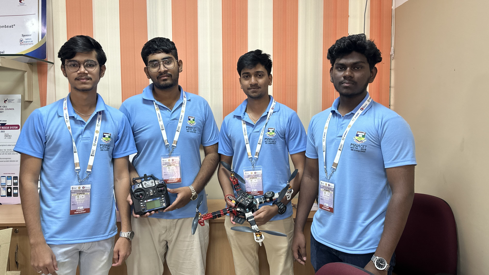

# 🌳 EcoGuard – AI-Powered Drone Surveillance for Forest Protection

**EcoGuard** is an innovative AI-based drone surveillance system designed to protect forests from illegal activities like **poaching**, **logging**, and **wildfires**. It combines **real-time AI object detection**, **blockchain-secured data**, and **long-range communication (LoRa FANET)** to provide an autonomous, tamper-proof, and scalable solution for environmental monitoring.

---

## 🚀 Project Overview

EcoGuard enables forest departments, NGOs, and conservation agencies to:
- Monitor forests in real-time with drones
- Automatically detect threats (humans, fires, deforestation)
- Secure the data using blockchain (Hyperledger Fabric)
- Operate even in no-internet zones using LoRa-based FANET
- Allow public reporting of incidents through a website portal

---

## 🛠️ Drone Specifications & Components

| Component | Description |
|----------|-------------|
| **Camera** | Raspberry Pi 5MP + Lepton Thermal Camera |
| **GPS** | U-BLOX NEO 6M GPS for accurate location tracking |
| **Processor** | Raspberry Pi running YOLOv5 object detection |
| **Connectivity** | LoRa SX1276 (for low-power, long-range communication) |
| **Power** | 6V Solar Panel and Rechargeable Battery |
| **Mapping** | Integrated with Google Earth Engine for satellite data |

### 📷 Drone Images

 Drone Prototype 

  
<!-- Replace with your actual image paths inside /images folder -->

---

## 🧠 Core Technologies Used

- 🔍 **YOLOv5** – Real-time object detection (human, fire, axe, etc.)
- 🔗 **Hyperledger Fabric (PBFT)** – Securing surveillance logs on blockchain
- 📡 **LoRa & FANET** – Enables drone communication without internet
- 🌍 **Google Earth Engine** – Visualizing real-time geospatial forest data
- 🌐 **Web Portal** – For public incident reporting & map-based dashboard  


---

## 🔄 How It Works

1. Drones fly autonomously over forest zones.
2. YOLOv5 processes live video feed to detect threats.
3. Data is securely transmitted using LoRa to a central node.
4. Detected incidents are stored immutably using blockchain.
5. Reports are visualized and alerts are sent to officials.
6. Public can also report illegal activity through the web portal.

---
This is our [Tracking Website](https://tracking-deforestation.vercel.app/)
---

## 👨‍💻 Our Team – *Drone Voyagers*



| Name               | Role                              |
|--------------------|-----------------------------------|
| Yahya K T          | Project Lead                      |
| Akshaay Krithick   | Drone Developer & Market Analyst  |
| Sridharan VG       | R&D and AIML Specialist           |
| Uwais Abdul Salam  | Web UI/UX and Media Support       |

We are a passionate team of engineers dedicated to using emerging technology for sustainable environmental conservation 🌿

---

This is a [Next.js](https://nextjs.org/) project bootstrapped with [`create-next-app`](https://github.com/vercel/next.js/tree/canary/packages/create-next-app).

## Getting Started

First, run the development server:

```bash
npm run dev
# or
yarn dev
# or
pnpm dev
# or
bun dev
```

Open [http://localhost:3000](http://localhost:3000) with your browser to see the result.

You can start editing the page by modifying `app/page.tsx`. The page auto-updates as you edit the file.

This project uses [`next/font`](https://nextjs.org/docs/basic-features/font-optimization) to automatically optimize and load Inter, a custom Google Font.

## Learn More

To learn more about Next.js, take a look at the following resources:

- [Next.js Documentation](https://nextjs.org/docs) - learn about Next.js features and API.
- [Learn Next.js](https://nextjs.org/learn) - an interactive Next.js tutorial.

You can check out [the Next.js GitHub repository](https://github.com/vercel/next.js/) - your feedback and contributions are welcome!

## Deploy on Vercel

The easiest way to deploy your Next.js app is to use the [Vercel Platform](https://vercel.com/new?utm_medium=default-template&filter=next.js&utm_source=create-next-app&utm_campaign=create-next-app-readme) from the creators of Next.js.

Check out our [Next.js deployment documentation](https://nextjs.org/docs/deployment) for more details.

